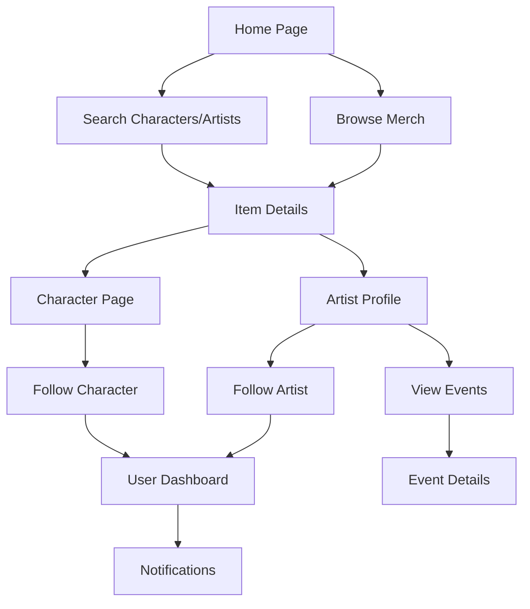

## 1. Product Overview

Baguetto is a web application that connects fans with character merchandise by allowing users to share and discover merch based on characters, licenses, artists, and availability at events like popup shops and conventions. The platform enables license holders to track where their characters are being sold and notifies followers when their favorite artists appear at specific events.

The application serves as a community-driven marketplace discovery tool that bridges the gap between creators, license holders, and fans in the merchandise ecosystem.

## 2. Core Features

### 2.1 User Roles

| Role           | Registration Method                              | Core Permissions                                                 |
| -------------- | ------------------------------------------------ | ---------------------------------------------------------------- |
| Fan User       | Email/Google/GitHub registration via Better Auth | Browse merch, follow artists/characters, receive notifications   |
| Artist/Maker   | Email/Google/GitHub registration via Better Auth | Create maker profile, add items, link to events                  |
| License Holder | Email/Google/GitHub registration via Better Auth | View character usage, receive notifications, manage license info |

### 2.2 Feature Module

Our merch sharing platform consists of the following main pages:

1. **Home page**: Hero section, featured merch, trending artists, navigation.
2. **Browse page**: Filter and search merch by character, license, artist, event type.
3. **Item details page**: Merch images, description, artist info, availability locations.
4. **Artist profile page**: Portfolio, upcoming events, merch catalog, follow button.
5. **Character/License page**: Character info, associated merch, license details.
6. **Events page**: Convention/popup listings, participating artists, dates.
7. **User dashboard**: Followed artists/characters, notification settings, saved items.

### 2.3 Page Details

| Page Name      | Module Name      | Feature description                                                                   |
| -------------- | ---------------- | ------------------------------------------------------------------------------------- |
| Home page      | Hero section     | Display mascot branding with pastel colors, search bar for quick merch discovery.     |
| Home page      | Featured merch   | Carousel of trending items with character tags and artist attribution.                |
| Home page      | Navigation       | Top nav with logo, search, user menu following existing navbar pattern.               |
| Browse page    | Filter sidebar   | Multi-select filters for characters, licenses, artists, event types, item categories. |
| Browse page    | Merch grid       | Card-based layout showing item images, names, artists, availability badges.           |
| Item details   | Image gallery    | Multiple product images with zoom functionality, show different angles.               |
| Item details   | Info section     | Display item name, description, artist link, character/license tags, price range.     |
| Item details   | Availability map | List/show events where item is available with dates and booth info.                   |
| Artist profile | Header           | Cover image, avatar, artist name, bio, social links, follow count.                    |
| Artist profile | Portfolio        | Grid of artist's merch items with character/license tags.                             |
| Artist profile | Events calendar  | Upcoming convention/popup appearances with item previews.                             |
| Character page | Character info   | Official artwork, description, license holder attribution.                            |
| Character page | Merch catalog    | All items featuring this character across different artists.                          |
| Events page    | Event listings   | Cards showing event name, dates, location, participating artist count.                |
| Events page    | Artist directory | Filter artists by event, view their planned merchandise.                              |
| User dashboard | Following feed   | Recent activity from followed artists and characters.                                 |
| User dashboard | Notifications    | Alert settings for new merch, event appearances, character usage.                     |

## 3. Core Process

### Fan User Flow

Users discover merch through browsing or search, follow favorite artists and characters, and receive notifications when new items appear or when followed entities participate in events. They can save items for later reference and share discoveries with others.

### Artist/Maker Flow

Artists create profiles showcasing their work, link items to characters/licenses they have permission to use, and update their event participation. They gain followers who receive notifications about new releases and appearances.

### License Holder Flow

License holders monitor where their characters appear across the platform, receive notifications about new merch using their IP, and can verify or flag unauthorized usage.

## 4. User Interface Design

### 4.1 Design Style

Building on the existing design system with these specifications:

- **Primary color**: Red (#ed253c) as specified, maintaining brand consistency
- **Secondary colors**: Pastel palette including soft pinks, lavenders, mint greens, and peach tones
- **Button style**: Rounded corners with subtle shadows, maintaining existing daisyUI patterns
- **Font**: Inter variable font family for consistency with current implementation
- **Layout style**: Card-based design with the existing navbar pattern, responsive grid layouts
- **Mascot integration**: Include mascot character in hero sections and empty states
- **Icon style**: Rounded, friendly icons that complement the pastel aesthetic

### 4.2 Page Design Overview

| Page Name      | Module Name    | UI Elements                                                                                             |
| -------------- | -------------- | ------------------------------------------------------------------------------------------------------- |
| Home page      | Hero section   | Full-width pastel gradient background with mascot illustration, centered search bar with rounded input. |
| Browse page    | Filter sidebar | Collapsible pastel-colored filter pills with character avatars and license badges.                      |
| Item details   | Image gallery  | Large rounded image carousel with thumbnail navigation, pastel accent borders.                          |
| Artist profile | Header         | Rounded cover image with circular avatar overlay, follow button in primary red.                         |
| Events page    | Event cards    | Pastel-colored event cards with date badges, location pins, and artist avatars.                         |

### 4.3 Responsiveness

Desktop-first design approach with mobile adaptation:

- Full functionality on desktop with multi-column layouts
- Collapsible navigation and filters for tablet viewports
- Single-column mobile layout with touch-optimized interactions
- Swipe gestures for image galleries on mobile devices
