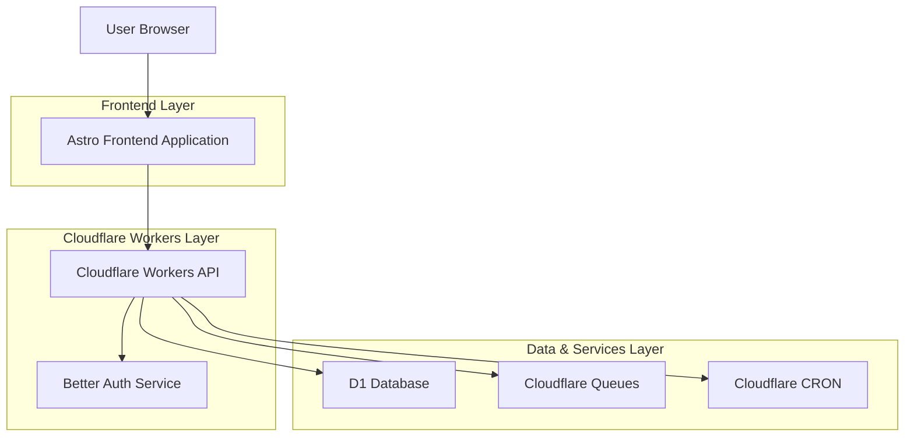
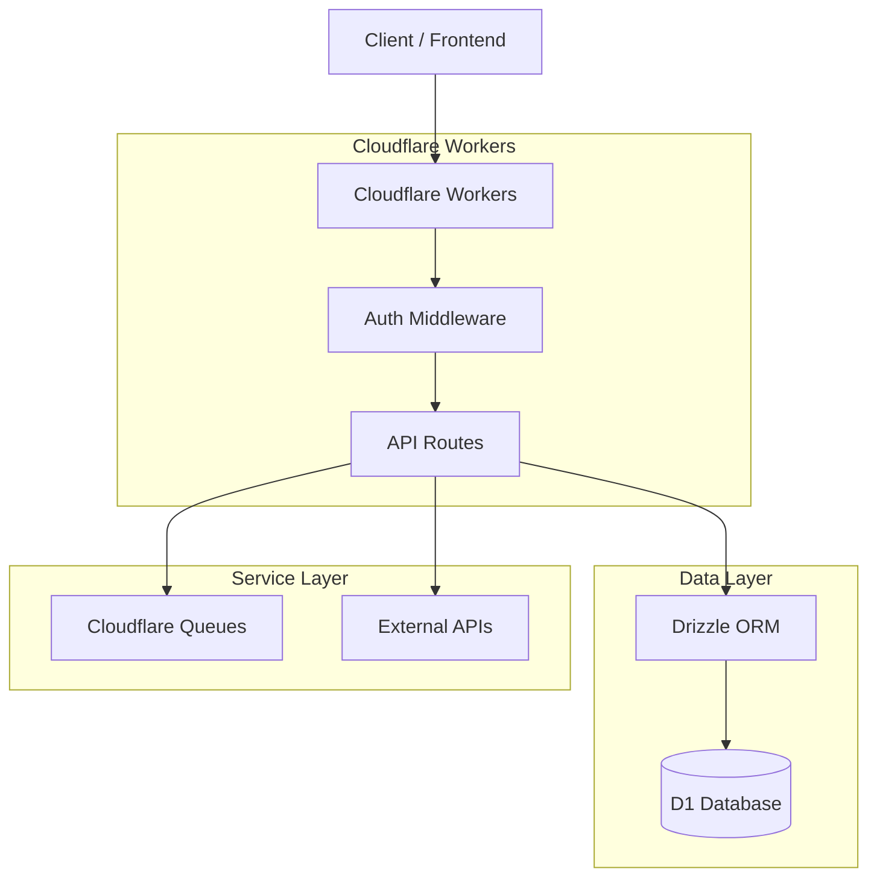
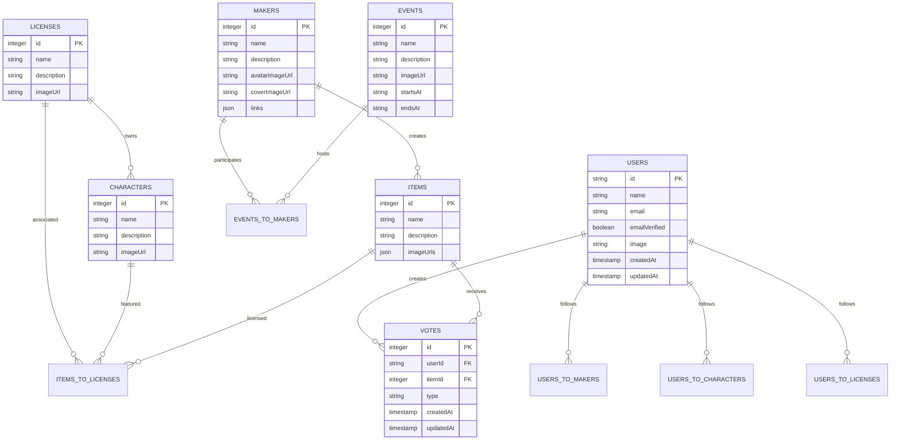

## 1. Architecture design



## 2. Technology Description

- Frontend: Astro + React components + TailwindCSS + daisyUI

- Initialization Tool: Existing Astro setup

- Backend: Cloudflare Workers with Drizzle ORM

- Database: Cloudflare D1 (SQLite)

- Styling: TailwindCSS with daisyUI components

- Authentication: Better Auth with multiple providers

- Queue System: Cloudflare Queues for notifications

- Scheduling: Cloudflare CRON for periodic tasks

## 3. Route definitions

| Route               | Purpose                                        |
| ------------------- | ---------------------------------------------- |
| /                   | Home page with hero section and featured merch |
| /browse             | Merch browsing with filters and search         |
| /items/\[id]        | Individual item details page                   |
| /artists/\[id]      | Artist profile with portfolio and events       |
| /characters/\[id]   | Character page with associated merch           |
| /licenses/\[id]     | License holder page with character catalog     |
| /events             | Events listing page                            |
| /events/\[id]       | Individual event details                       |
| /dashboard          | User dashboard with follows and notifications  |
| /api/auth/\[...all] | Authentication endpoints                       |

## 4. API definitions

### 4.1 Core API

**Get Merch Items**

```
GET /api/items
```

Request:

| Param Name  | Param Type | isRequired | Description               |
| ----------- | ---------- | ---------- | ------------------------- |
| characterId | integer    | false      | Filter by character ID    |
| licenseId   | integer    | false      | Filter by license ID      |
| artistId    | integer    | false      | Filter by artist/maker ID |
| eventId     | integer    | false      | Filter by event ID        |
| category    | string     | false      | Filter by item category   |

Response:

| Param Name | Param Type | Description                        |
| ---------- | ---------- | ---------------------------------- |
| items      | array      | Array of item objects with details |
| totalCount | integer    | Total number of matching items     |

**Follow Artist/Character**

```
POST /api/follow
```

Request:

| Param Name | Param Type | isRequired | Description                         |
| ---------- | ---------- | ---------- | ----------------------------------- |
| type       | string     | true       | Either 'artist' or 'character'      |
| targetId   | integer    | true       | ID of artist or character to follow |

**Get Notifications**

```
GET /api/notifications
```

Response:

| Param Name    | Param Type | Description                    |
| ------------- | ---------- | ------------------------------ |
| notifications | array      | Array of notification objects  |
| unreadCount   | integer    | Number of unread notifications |

### 4.2 Cloudflare Workers Implementation

**Environment Types**

```typescript
export interface Env {
  DB: D1Database;
  BETTER_AUTH_SECRET: string;
  BETTER_AUTH_URL: string;
  QUEUE: Queue;
  CRON_SECRET: string;
}
```

**Database Binding Pattern**

```typescript
// src/routes/api/items.ts
import { getDB } from "~/db";

export async function onRequestGet(context) {
  const db = getDB(context.env);
  const { searchParams } = new URL(context.request.url);

  const characterId = searchParams.get("characterId");
  const artistId = searchParams.get("artistId");

  let query = db.select().from(items);

  if (characterId) {
    query = query.where(eq(items.characterId, characterId));
  }

  const items = await query;
  return Response.json({ items, totalCount: items.length });
}
```

**Queue Integration for Notifications**

```typescript
// src/routes/api/follow.ts
export async function onRequestPost(context) {
  const { userId, targetId, type } = await context.request.json();
  const db = getDB(context.env);

  // Create follow relationship
  await db.insert(usersToMakers).values({ userId, makerId: targetId });

  // Queue notification for followed artist
  await context.env.QUEUE.send({
    type: "new_follower",
    userId,
    targetId,
    timestamp: new Date().toISOString(),
  });

  return Response.json({ success: true });
}
```

**CRON Job for Event Notifications**

```typescript
// src/crons/event-notifications.ts
export async function scheduled(
  event: ScheduledEvent,
  env: Env,
  ctx: ExecutionContext,
) {
  const db = getDB(env);

  // Get upcoming events within 24 hours
  const upcomingEvents = await db
    .select()
    .from(events)
    .where(between(events.startsAt, new Date(), addDays(new Date(), 1)));

  // Queue notifications for followers
  for (const event of upcomingEvents) {
    await env.QUEUE.send({
      type: "event_reminder",
      eventId: event.id,
      timestamp: new Date().toISOString(),
    });
  }
}
```

## 5. Server architecture diagram



## 6. Data model

### 6.1 Data model definition



### 6.2 Data Definition Language

**Database Binding Configuration**

```toml
# wrangler.toml
[[d1_databases]]
binding = "DB"
database_name = "baguetto-db"
database_id = "your-database-id"
```

**Drizzle ORM Schema Configuration**

```typescript
// src/db/schema.ts
import { sqliteTable, text, integer, real } from "drizzle-orm/sqlite-core";
import { createInsertSchema, createSelectSchema } from "drizzle-zod";

export const users = sqliteTable("users", {
  id: text("id").primaryKey(),
  name: text("name").notNull(),
  email: text("email").notNull().unique(),
  emailVerified: integer("email_verified", { mode: "boolean" }).notNull(),
  image: text("image"),
  createdAt: integer("created_at", { mode: "timestamp" }).notNull(),
  updatedAt: integer("updated_at", { mode: "timestamp" }).notNull(),
});

export const items = sqliteTable("items", {
  id: integer("id").primaryKey({ autoIncrement: true }),
  name: text("name").notNull(),
  description: text("description"),
  imageUrls: text("image_urls", { mode: "json" }).notNull().default("[]"),
  category: text("category"),
  priceRange: text("price_range"),
  availabilityStatus: text("availability_status").default("available"),
  makerId: integer("maker_id").references(() => makers.id),
  createdAt: integer("created_at", { mode: "timestamp" }).notNull(),
  updatedAt: integer("updated_at", { mode: "timestamp" }).notNull(),
});

export const events = sqliteTable("events", {
  id: integer("id").primaryKey({ autoIncrement: true }),
  name: text("name").notNull(),
  description: text("description").notNull(),
  imageUrl: text("image_url").notNull(),
  startsAt: text("starts_at").notNull(),
  endsAt: text("ends_at").notNull(),
  location: text("location"),
  eventType: text("event_type"),
  websiteUrl: text("website_url"),
  createdAt: integer("created_at", { mode: "timestamp" }).notNull(),
  updatedAt: integer("updated_at", { mode: "timestamp" }).notNull(),
});

export const notifications = sqliteTable("notifications", {
  id: integer("id").primaryKey({ autoIncrement: true }),
  userId: text("user_id").references(() => users.id),
  type: text("type").notNull(),
  title: text("title").notNull(),
  message: text("message").notNull(),
  relatedId: integer("related_id"),
  relatedType: text("related_type"),
  isRead: integer("is_read", { mode: "boolean" }).default(false),
  createdAt: integer("created_at", { mode: "timestamp" }).notNull(),
});
```

**Database Access Pattern**

```typescript
// src/db/index.ts
import { drizzle } from "drizzle-orm/d1";
import * as schema from "./schema";

export function getDB(env: Env) {
  return drizzle(env.DB, { schema });
}

// Usage in API routes
export async function onRequest(context) {
  const db = getDB(context.env);
  const items = await db.select().from(schema.items);
  return Response.json(items);
}
```
